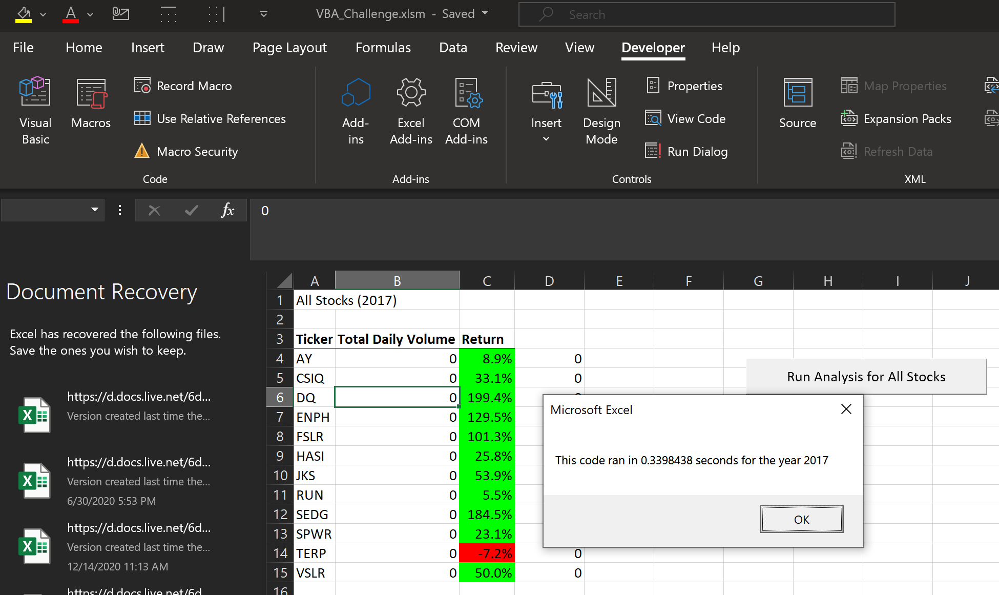
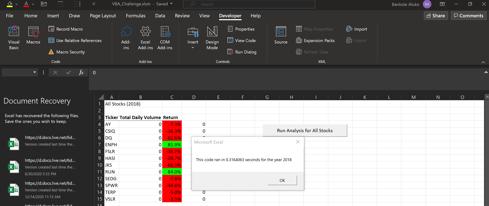

# Overview of Project
## This project provides trading volume and yield analysis of 12 green stocks

# Results of the analysis
## 2017 was a good year for most green stocks. Every stock except TERP appreciated in value, see . In addition, the refactored code ran at 0.34 seconds in 2017, compared to the 1.2 seconds for the original code

## In 2018, the stocks performed comparatively worse, with only two stocks (EnPH and RuN) appreciating in value, see . The refactored code ran at 0.32 seconds in 2018, compared to the 1.2 seconds for the original code

# Summary
## The advantages of refactored code is that it make the code run more efficiently. However, it requires more time to refine and code appropriately. This was demonstrated with the VBA script, which took 5x as long to run without being refactored, but took maybe an hour or so to refactor.
